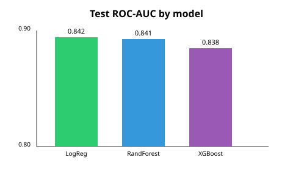
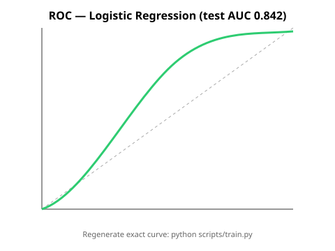
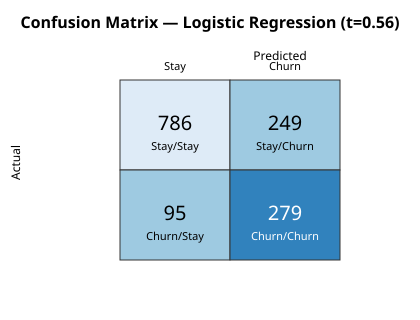
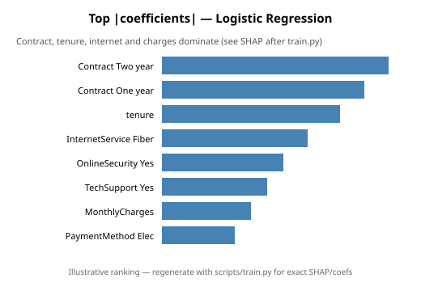

# Customer Churn Prediction (Telco)

Resume-ready end-to-end ML project that predicts whether a telecom customer will churn, using the public **IBM Telco Customer Churn** dataset.

**Best model (held-out test):** Logistic Regression · **ROC-AUC 0.842** · **PR-AUC 0.633** · **F1 0.619** (threshold 0.56)

---

## Problem

Customer retention is cheaper than acquisition. This project builds a production-style **scikit-learn Pipeline** that:

1. Cleans and encodes mixed numeric/categorical telco features
2. Handles class imbalance (~26.5% churn)
3. Compares Logistic Regression, Random Forest, and XGBoost
4. Exposes predictions + SHAP-style explanations in a Streamlit app

## Dataset

| Item | Detail |
|------|--------|
| Source | [IBM Sample Telco Customer Churn](https://github.com/IBM/telco-customer-churn-on-icp4d) |
| Rows | 7,043 customers |
| Target | `Churn` (Yes/No → 1/0) |
| Features | tenure, charges, contract, internet/phone add-ons, payment method, etc. |
| License / attribution | IBM Sample Data Sets — community sample for education/demos; not for commercial redistribution claims. Cite IBM / original Kaggle mirror when sharing. |

Download via script (full CSV is gitignored; a small sample is included):

```bash
python scripts/download_data.py
```

## Approach

```
raw CSV → clean → ColumnTransformer (impute/scale + one-hot)
       → train LR / RF / XGBoost with imbalance handling
       → tune decision threshold for F1 on train
       → evaluate on stratified 20% holdout
       → SHAP / feature contributions → persist Pipeline
```

**Imbalance handling**

- `class_weight='balanced'` (Logistic Regression) / `balanced_subsample` (Random Forest)
- `scale_pos_weight = n_neg / n_pos` (XGBoost)
- Decision threshold swept on the **training** set to maximize F1, then applied to test

## Results (test set)

| Model | ROC-AUC | PR-AUC | F1 | Precision | Recall | Threshold |
|-------|---------|--------|-----|-----------|--------|-----------|
| **Logistic Regression** | **0.8416** | 0.6327 | **0.6186** | 0.5284 | **0.7460** | 0.56 |
| Random Forest | 0.8409 | 0.6470 | 0.6139 | 0.5497 | 0.6952 | 0.54 |
| XGBoost | 0.8375 | **0.6519** | 0.6141 | **0.5698** | 0.6658 | 0.60 |

Selection criterion: **highest ROC-AUC** → Logistic Regression (very close to RF). XGBoost leads on PR-AUC.

### Figures









Precision–Recall: [`reports/figures/pr_curve.svg`](reports/figures/pr_curve.svg)

## Project structure

```
customer-churn-ml/
├── app/streamlit_app.py
├── data/raw/                     # sample CSV + download target
├── models/churn_pipeline.joblib.b64  # ASCII model (decode or train)
├── notebooks/01_eda.ipynb, 02_modeling.ipynb
├── reports/metrics.json + figures/
├── scripts/download_data.py, train.py
├── src/                          # data, preprocess, train, evaluate, explain
└── requirements.txt
```

## How to run

```bash
python -m venv .venv
source .venv/bin/activate          # Windows: .venv\Scripts\activate
pip install -r requirements.txt
python scripts/download_data.py
python scripts/train.py            # writes models/*.joblib (+ .b64), reports/, figures/
streamlit run app/streamlit_app.py
```

The Streamlit app loads `models/churn_pipeline.joblib` if present, otherwise decodes `models/churn_pipeline.joblib.b64`.

## Tech stack

Python · pandas · NumPy · scikit-learn · XGBoost · SHAP · matplotlib / seaborn · Streamlit · joblib

## Notes

- Metrics are from a real training run (`reports/metrics.json`).
- Full raw CSV is not committed; use the download script.
- Re-running `scripts/train.py` regenerates exact matplotlib PNG/SVG diagnostics and the joblib pipeline.
